## 第一部分
### 剩余类、完全剩余系、简化剩余系
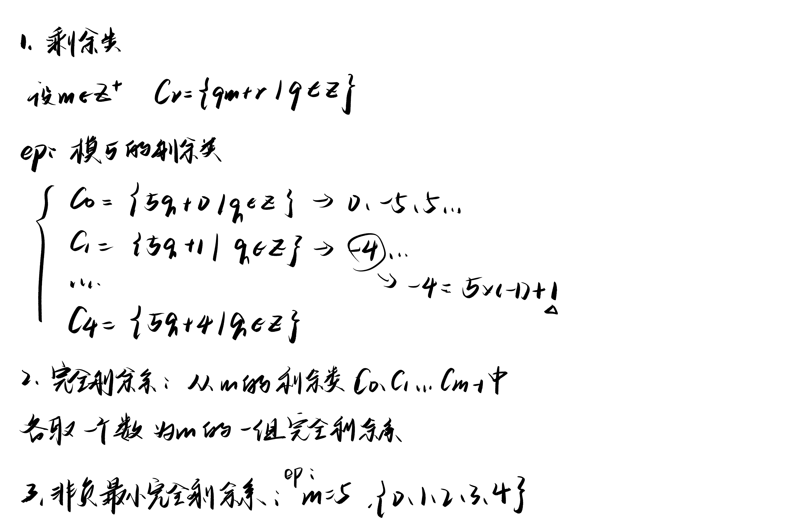

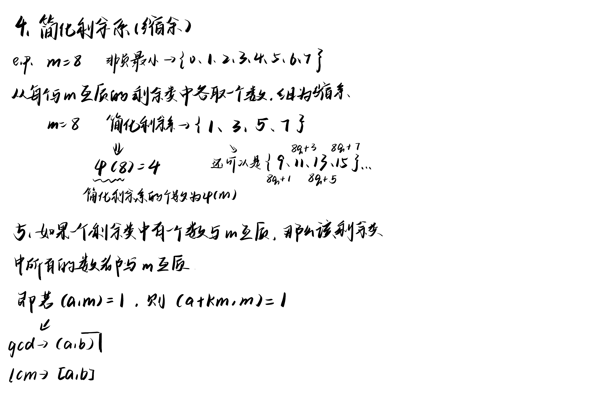
### 平方剩余和平方非剩余

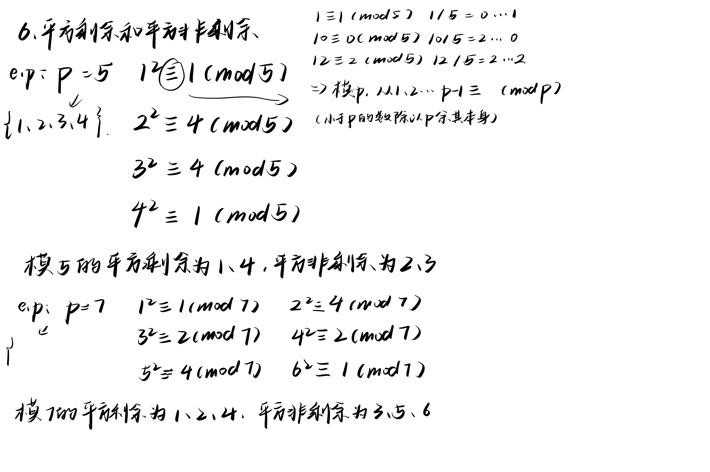
### 欧几里得算法求逆元

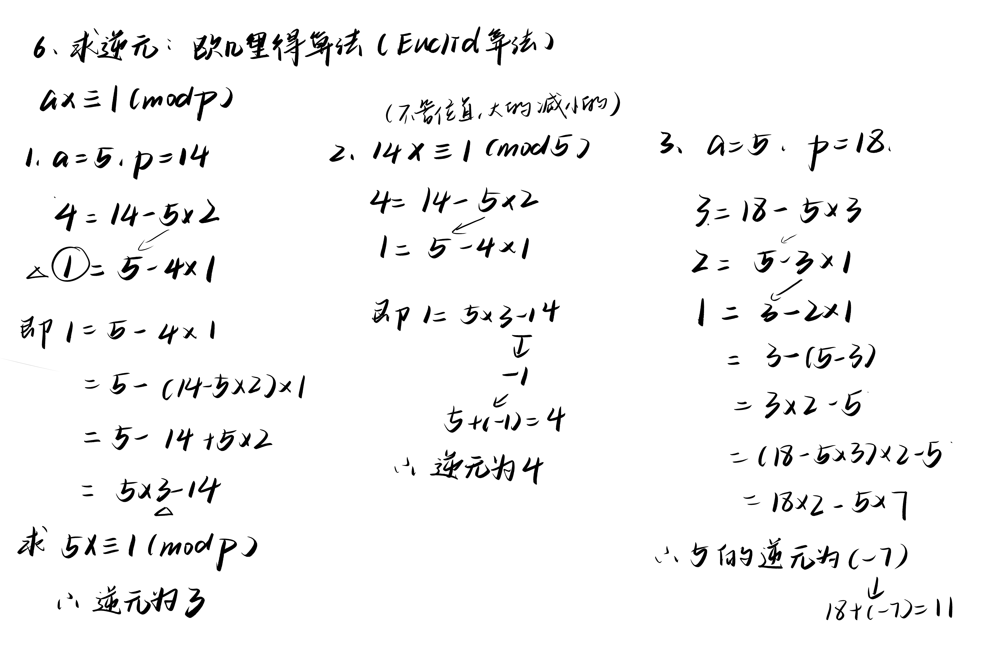
## 第二部分
### 求逆元补充
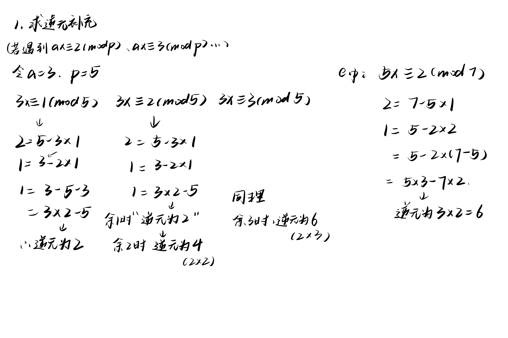
### 欧拉定理、指数和原根
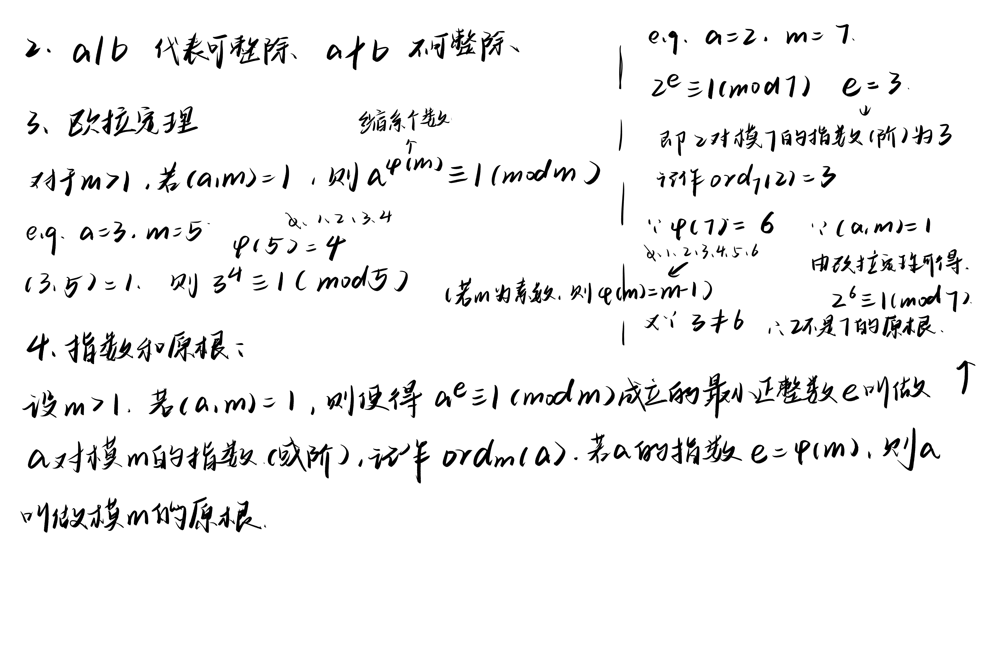
### 指数的性质、费马小定理、威尔逊定理
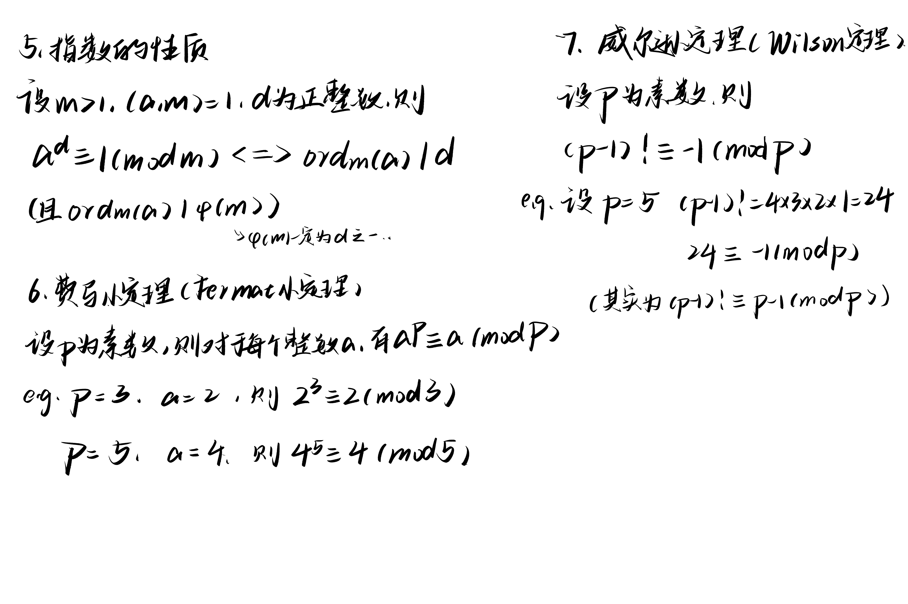
### 定理补充
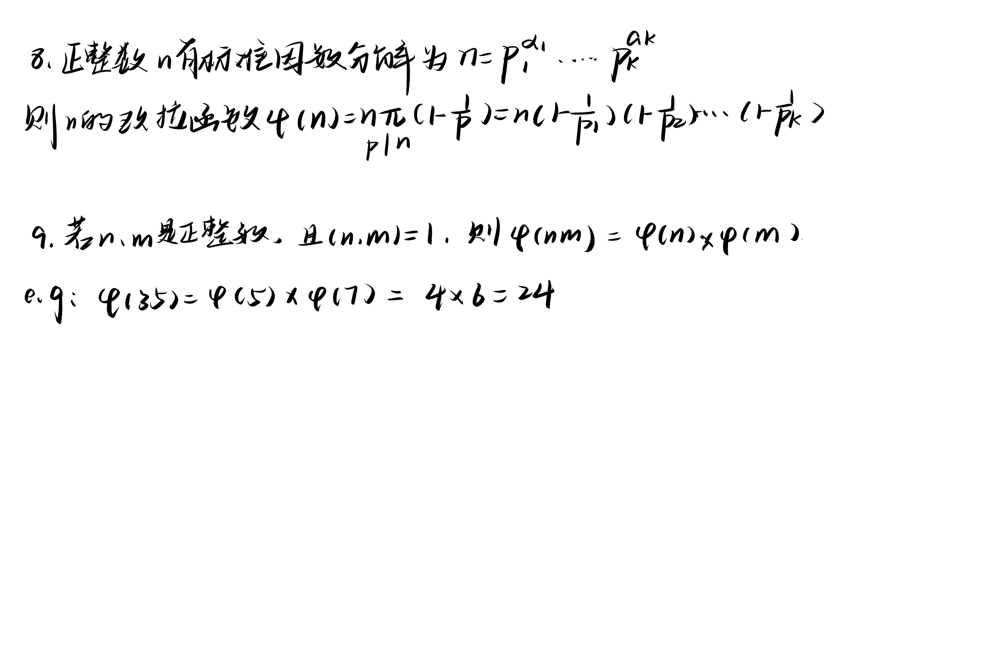
### 例题
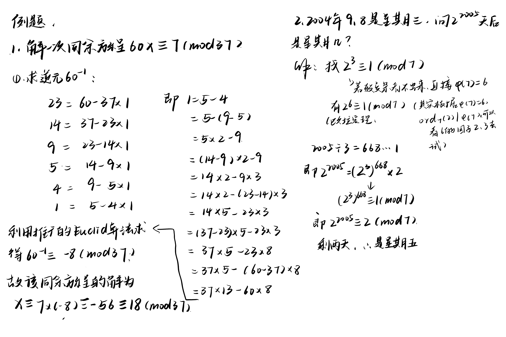
## 中国剩余定理
### 定义
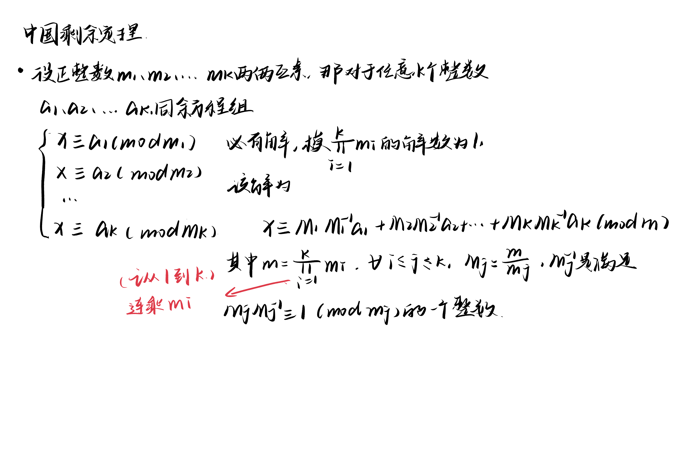
### 例题一
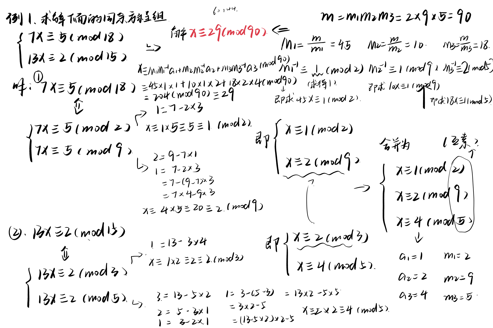
### 例题二
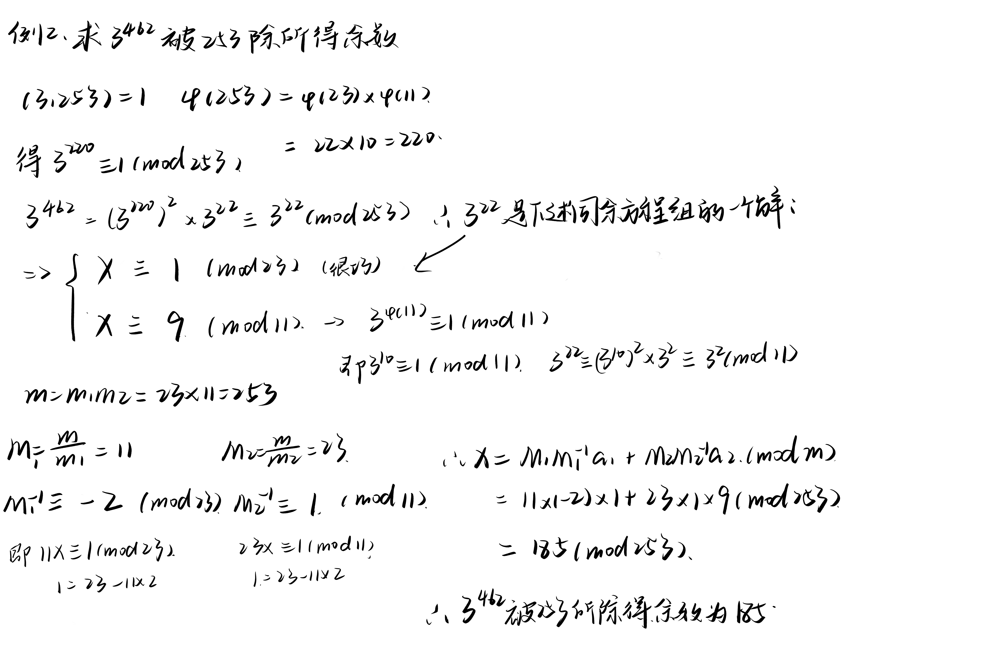
## 快速模乘法
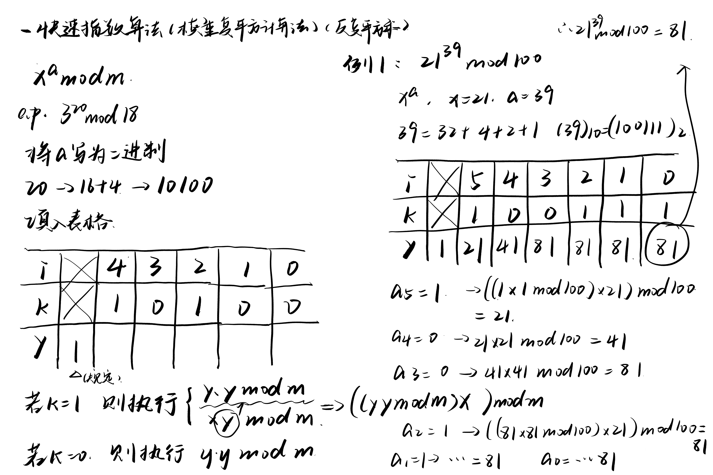

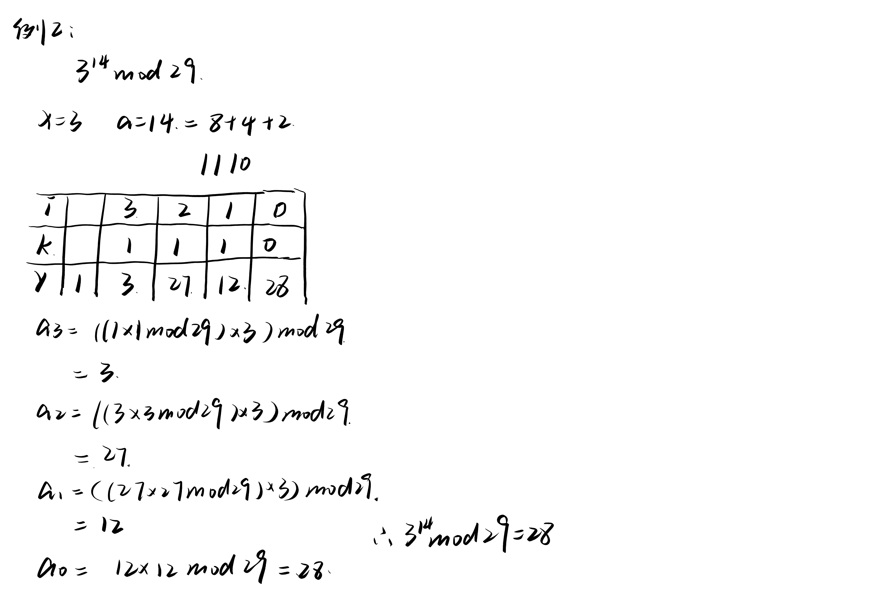

## RSA加密算法
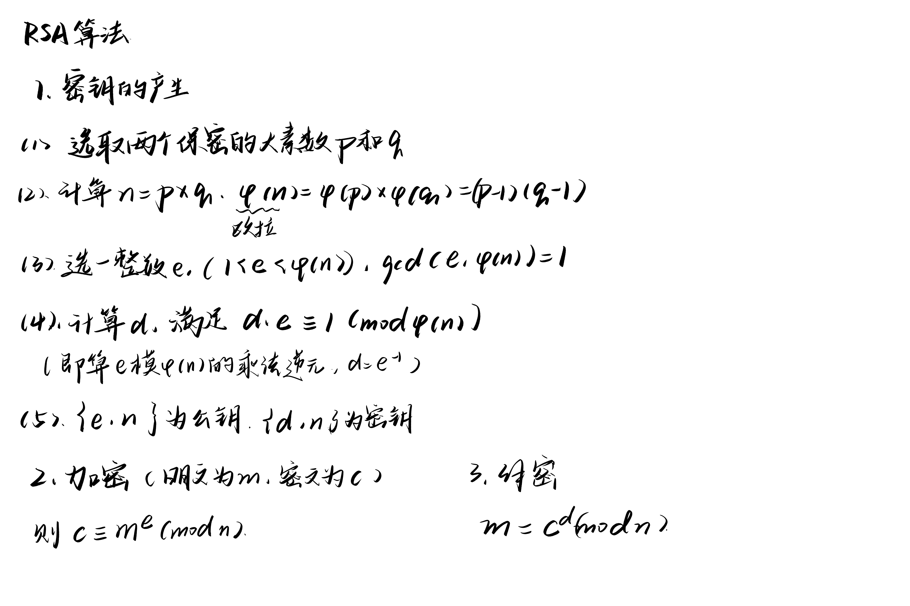