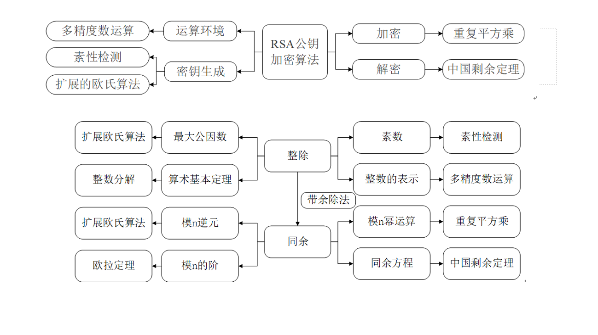
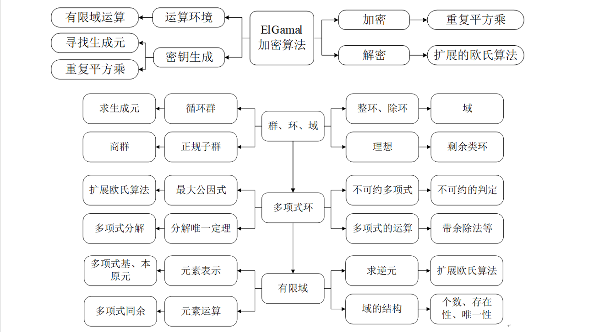
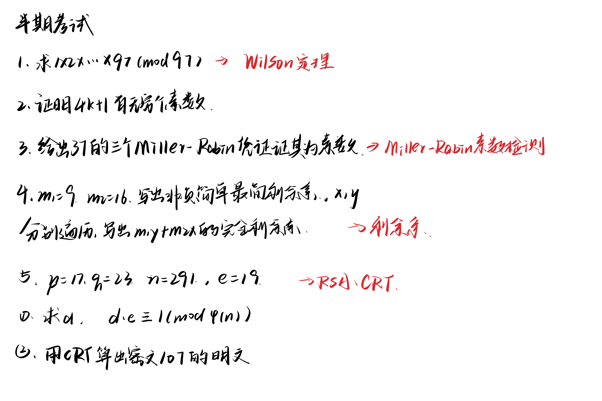

## ✂️信源
1. [速通课程](https://www.bilibili.com/video/BV1qw411w79A?vd_source=6dd39f309da808ea8b70ea574dc1fb37)
## 📋知识点汇总

## ✏️速通-1

### 剩余类、完全剩余系、简化剩余系

### 平方剩余和平方非剩余

### 欧几里得算法求逆元

## ✏️速通-2

### 求逆元补充

### 欧拉定理、指数和原根

### 指数的性质、费马小定理、威尔逊定理

### 定理补充

### 例题

## ✏️速通-中国剩余定理

### 定义

### 例题一

### 例题二

## ✏️速通-快速模乘法

## ✏️速通-RSA加密算法

## 📝半期考试真题
女娲补天了一个晚上...考的大部分都是上课时讲的原题，可惜没听，速通课程也是以计算为重点，几道的知识点和证明都不会，还犯了很愚蠢的错误（公式记错了&忘了减一），七零八落的交了卷，感想是已老实😿

